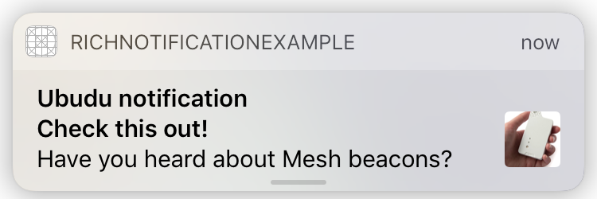
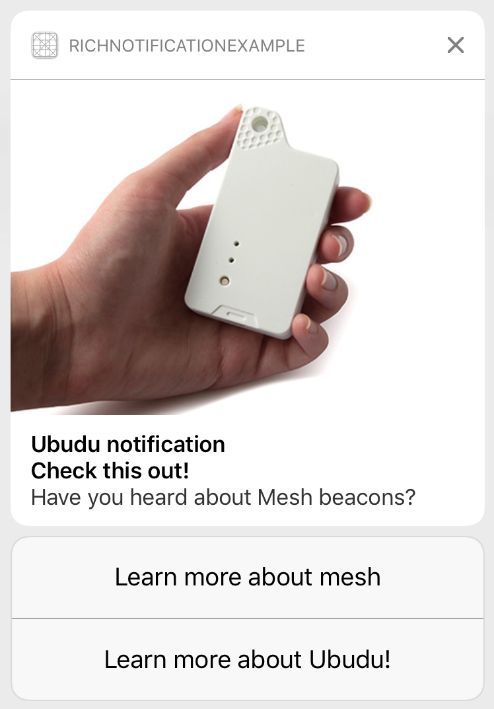

Rich Notification Example
===============

A simple app to illustrate possible handling of rich notification.

To test the app set a proximity UUID of your uBeacon to: `F2A74FC4-7625-44DB-9B08-CB7E130B2029`
with major: `1` and minor: `2`.

###Handling rich notification actions
Your app has to conform to `UNUserNotificationCenterDelegate` protocol so add the following code in th AppDelegate implementation file.

```@interface AppDelegate () <UNUserNotificationCenterDelegate>```

And implement its methods like this:

```
- (void)userNotificationCenter:(UNUserNotificationCenter *)center willPresentNotification:(UNNotification *)notification withCompletionHandler:(void (^)(UNNotificationPresentationOptions options))completionHandler
{
    // We want to see a notification even in the foreground so we call completionhandler in any case...
    completionHandler(UNNotificationPresentationOptionAlert);
}
```

In the implementation above you can determine whether you want or not to show a notification. In this case we want to show it in all cases. Even in foreground. Remember about callinf completionHandler.

To handle custom actions you need to implement this meethod:

```
- (void)userNotificationCenter:(UNUserNotificationCenter *)center 
didReceiveNotificationResponse:(UNNotificationResponse *)response
		 withCompletionHandler:(void(^)())completionHandler
``` 

In the example application the implementation is very simple:

```
- (void)userNotificationCenter:(UNUserNotificationCenter *)center didReceiveNotificationResponse:(UNNotificationResponse *)response withCompletionHandler:(void(^)())completionHandler
{
    // Get payload defined in the ubudu.manager.com for the rule
    NSDictionary *payload = [response.notification.request.content.userInfo objectForKey:@"payload"];
    
    // The identifier of the response action
    NSString *actionIdentifier = response.actionIdentifier;
    
    // URL which be filled with proper value based on action choosen by the user.
    NSString *urlToOpen = nil;
    
    // In the rule we have specified actions with identifiers:
    // 1 - ubuduActionAboutMeshIdentifier
    // 2 - ubuduActionAboutUbuduIdentifier
    // We also specified custom specific urls in the payload which you can get for keys:
    // 1 - aboutMeshUrl
    // 2 - aboutUbuduUrl
    
    // Determine which action was choosen by user
    if ([actionIdentifier isEqualToString:@"ubuduActionAboutMeshIdentifier"]) {
        urlToOpen = [payload objectForKey:@"aboutMeshUrl"];
    } else if ([actionIdentifier isEqualToString:@"ubuduActionAboutUbuduIdentifier"]) {
        urlToOpen = [payload objectForKey:@"aboutUbuduUrl"];
    }

    // Open the url
    if (urlToOpen != nil) { [[UbuduSDK sharedInstance] openWebPageForUrl:[NSURL URLWithString:urlToOpen]]; }
    
    // Notify ubudu server about opening a notification and eventually execute other actions related to that notification
    // (if specified) like open web page, deep link, wallet...
    [[UbuduSDK sharedInstance] executeNotificationRequestActions:response.notification.request];
    
    // Call a completion handler which notify the system that we've finished handling an action in a custom way...
    completionHandler();
}
```

###Defining notification in the ubudu.manager.com
To take advantages from rich notifications you need to specify the rule correctly. The json for the rule in this example looks like below:

```
{
  "alertTitle": "Ubudu notification",
  "alertSubtitle": "Check this out!",
  "alertBody": "Have you heard about Mesh beacons?",
  "bigIconUrl": "http://www.nfcworld.com/wp-content/uploads/2014/12/ubudu-ubeacon.jpg",
  "iosNotificationActions": [
    {
      "actionIdentifier": "ubuduActionAboutMeshIdentifier",
      "actionTitle": "Learn more about mesh",
      "options": []
    },
    {
      "actionIdentifier": "ubuduActionAboutUbuduIdentifier",
      "actionTitle": "Learn more about Ubudu!",
      "options": []
    }
  ],
  "iosImageUrl": "http://www.nfcworld.com/wp-content/uploads/2014/12/ubudu-ubeacon.jpg",
  "payload": {
    "aboutMeshUrl": "http://www.nfcworld.com/2014/12/15/333220/ubudu-turns-beacons-two-way-communications-devices/",
    "aboutUbuduUrl": "http://www.ubudu.com"
  }
}
```

`"iosImageUrl"` specifies the image you want to attach to the notification.

`"iosNotificationActions"` is an array of actions you want to attach to the notification. Each action has to have: `"actionIdentifier"`and `"actionTitle"`. 

The field `options` is optional and options are:

`"authentication_required"` - Whether this action should require unlocking before being performed.

`"destructive"` - Whether this action should be indicated as destructive.

`"foreground"` - Whether this action should cause the application to launch in the foreground.

After triggering a notification it should look like this:



and expanded version:
