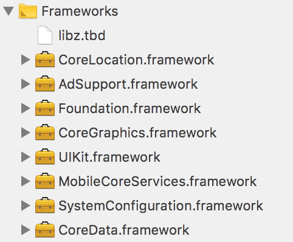
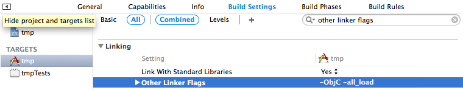
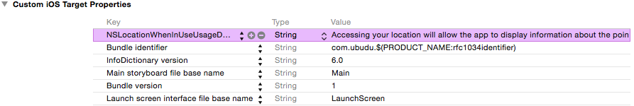
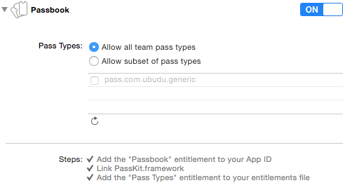
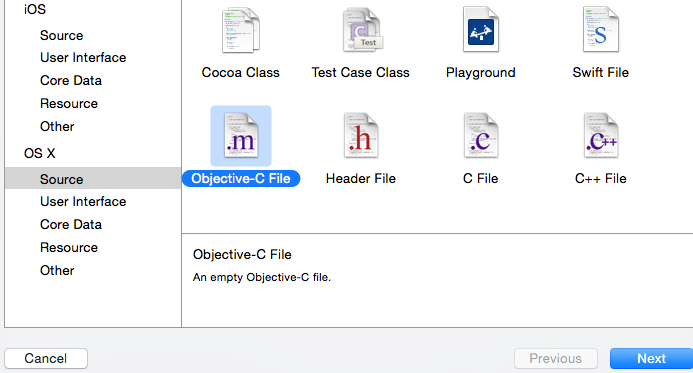
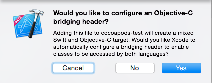
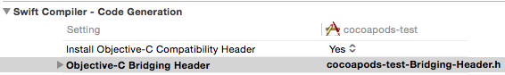
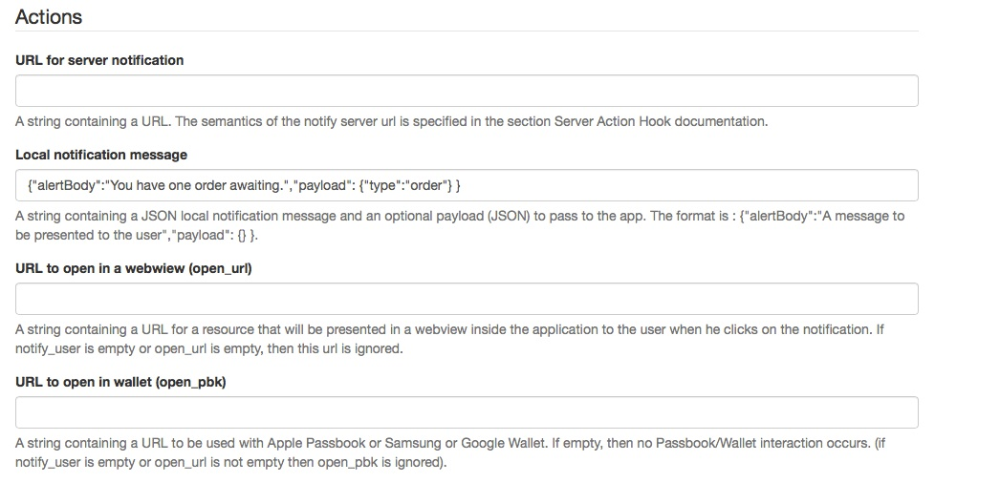
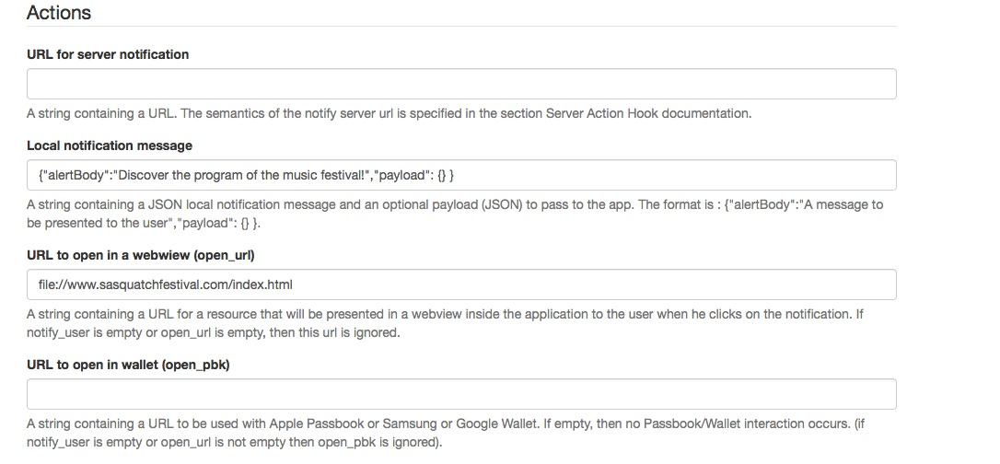
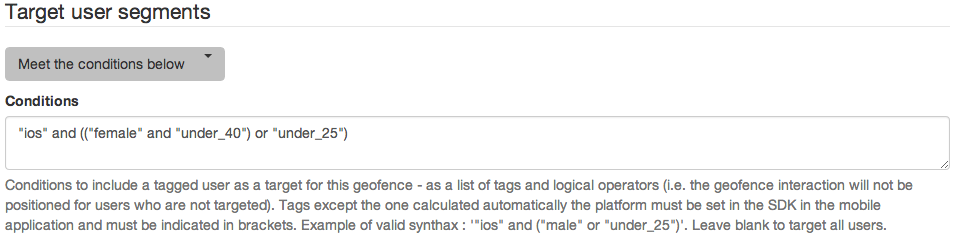

Ubudu iOS SDK
=======
Ubudu contextual interactions SDK for iOS.
For information on pricing, features, examples and our fantastic iBeacon compatible beacons please check our website [http://www.ubudu.com](http://www.ubudu.com). It is totally free to develop with Ubudu SDKs and we only charge active users above certain thresholds.

## System and hardware requirements
For iBeacon related features:

- iOS 7.0 or higher (IOS 7.1.2 or iOS 8.0+ recommended)
- iPhone 4S / iPad 3rd generation / iPad mini / iPod touch 5th generation, or any more recent device

For geofencing:

- iOS 6.0 or higher
- iPhone 4 or more recent

## I. Adding the Ubudu SDK to a project

Starting to use the Ubudu SDK on iOS native app should be a 5 to 10 minutes process. Have a look at the demo app in the directory for a complete example.

### Using CocoaPods

This is the prefered and simplest way to get started. Just add the following line to your *Podfile*

```
pod 'UbuduSDK'
```

then execute `pod install`.

If you are not already using CocoaPods for your project you can get started by reading the [CocoaPods documentation](http://guides.cocoapods.org/).

### Manually

If you don't want to use CocoaPods you can install the SDK manually by following the instructions bellow.

1. Drag & drop the *UbuduSDK.framework* folder into the Frameworks folder of your project in XCode.
Check the **"Copy items into destination group's folder (if needed)"** option.

2. Add the following frameworks and libraries to your project if they are not already present:
	- CoreLocation.framework
	- CoreBluetooth.framework
	- CoreData.framework
	- PassKit.framework
	- SystemConfiguration.framework
	- MobileCoreServices.framework
	- UIKit.framework
	- CoreGraphics.framework
	- Foundation.framework
	- libz.dylib

  If you don't know how to add an Apple framework to your project [follow these instructions.](https://developer.apple.com/library/ios/recipes/xcode_help-project_editor/Articles/AddingaLibrarytoaTarget.html#//apple_ref/doc/uid/TP40010155-CH17)
  
  Your framework folder should look like this:
  
    
3. In the project settings, go to `"General" -> "Your Target" -> "Build Settings" -> "Other Linker Flags"` and add the following flags: **-ObjC -all_load**

  

## II. Project configuration

### Location authorization

Since **iOS 8.0** it is required to add an entry to the *Info.plist* file that indicates wich location authorization is required by your app:

* To use the **"Always"** mode, which the SDK is primarily designed to work with, add the `NSLocationAlwaysUsageDescription` key. This mode allows your app to be awaken when near beacons (*via* beacon region monitoring) and to receive detailled beacon data updates (*via* beacon ranging) for a few minutes while the app is in background. There is no restriction applying when the app in foreground.

* If you decide to use the **"When In Use"** mode then add the `NSLocationWhenInUseUsageDescription` key. With this mode your app cannot be awaken when near beacons and cannot receive detailed beacon data updates when in background. Your app will only get detailed beacon data updates (beacon ranging) while in foreground.

  

##### Support both modes (optional)

You can decide to support both modes by providing the two keys. In this case the Ubudu SDK will by default try to get the **"Always"** location authorization but your users will have the possibility to "downgrade" the app location authorization to **"When In Use"** from the device settings.

If you'd rather have the SDK require "When In Use" authorization first (and let your user the possibility to "upgrade" the authorization to "Always" later) set the following option on the SDK to *YES* **/!\\ before calling start /!\\**.

```
[UbuduSDK sharedInstance].requestWhenInUseAuthorization = YES;
```

##### Support only "When In Use" mode (optional)

If you decide to support exclusively the "When In Use" mode then add only the `NSLocationWhenInUseUsageDescription` key to your *Info.plist* file **AND** set the same option as above to *YES* so the SDK will ask for the correct authorization.

```
[UbuduSDK sharedInstance].requestWhenInUseAuthorization = YES;
```

##### Remarks

```
The value(s) for the key(s) can be left empty, but if provided will be displayed in the alert
asking the user if he'd like to grant access to his physical location to the app.
You should provide a description of one or two line(s) of why you need to access your user's location so he will be more enclined to accept.
```

```
Warning: if you fail to properly provide the required key then the location access alert 
won't be displayed and your app will never get access to the location of the user.
```

### Other capabilities

If you plan to use the Passbook feature of the SDK in your application you should enable the corresponding capability in the **"Capabilities"** tab of XCode.



## III. Configure and start the SDK - Objective-C

1. In your *AppDelegate.m* file add the following statement:
`#import <UbuduSDK/UbuduSDK.h>`

2. Add this to you `didFinishLaunchingWithOptions:` method. You need to replace the app namespace by the one you created on the [Ubudu manager platform.](https://manager.ubudu.com)

    ```
[UbuduSDK sharedInstance].appNamespace = @"634b207ee2f313c109c58675b44324ac2d41e61e";
[UbuduSDK sharedInstance].delegate = self;
NSError *error = nil;
BOOL started = [[UbuduSDK sharedInstance] start:&error];
if (!started) {
    NSLog(@"UbuduSDK start error: %@", error);
}
```
The delegate is the object which will be receiving all the notifications via callbacks defined in the **UbuduSDKDelegate** protocol. This might be your AppDelegate for example.  

3. To allow to the SDK to work as expected (automatic execution of the actions other than "notifications", i.e. open a web page) you need to implement the UIKit callback `application:didReceiveLocalNotification:` like this:

    ```
- (void)application:(UIApplication *)application didReceiveLocalNotification:(UILocalNotification *)notification
{
    [[UbuduSDK sharedInstance] executeLocalNotificationActions:notification];
}
```

### Stop the SDK

If you want the SDK to stop running then call:

```
[[UbuduSDK sharedInstance] stop];
```

Stopping the SDK will stop it from updating location and tracking geofences and beacons. It will also prevent your app from being awaken by the system (you will not have background support after that).

### Full code example

Here is a full example on how to initialize and start the SDK:

```
// AppDelegate.m

#import <UbuduSDK/UbuduSDK.h>

@implementation AppDelegate

- (BOOL)application:(UIApplication *)application didFinishLaunchingWithOptions:(NSDictionary *)launchOptions
{
    [UbuduSDK sharedInstance].appNamespace = @"634b207ee2f313c109c58675b44324ac2d41e61e";
    [UbuduSDK sharedInstance].delegate = self;
    /* Optionally, provide the ID of your user so we can link the Ubudu user with the IDs of your information system. */
    //[UbuduSDK sharedInstance].user = [[UbuduUser alloc] initWithID:@"Your client ID" withProperties:@{@"foo_property":@"bar_value"}];
    NSError *error = nil;
    BOOL started = [[UbuduSDK sharedInstance] start:&error];
    if (!started) {
        NSLog(@"UbuduSDK start error: %@", error);
    }
}

- (void)application:(UIApplication *)application didReceiveLocalNotification:(UILocalNotification *)notification
{
    [[UbuduSDK sharedInstance] executeLocalNotificationActions:notification];
}
```

## III Bis. Configure and start the SDK - Swift

Once the framework or pod has been installed you need to add a bridging header, which XCode automatically creates when you want to add the first Objective-C file to a Swift project.
So in an empty project we just add a file called "dummy"". This file can be deleted later.



Then Xcode will ask



This auto-generation will also add the corresponding path to this header file into your Build Settings



Into this header file *cocoapods-test-Bridging-Header.h* you can then import the required header
`#import <UbuduSDK/UbuduSDK.h>`

Then in the *AppDelegate.swift* add the protocol `UbuduSDKDelegate`, the initialization of the UbuduSDK and the minimal callbacks functions. For instance:

```
import AdSupport // add AdSupport for optional profiling step

@UIApplicationMain
class AppDelegate: UIResponder, UIApplicationDelegate, UbuduSDKDelegate {

    var window: UIWindow?

    func application(application: UIApplication, didFinishLaunchingWithOptions launchOptions: [NSObject: AnyObject]?) -> Bool {
        var ubuduSDK = UbuduSDK.sharedInstance() as UbuduSDK
        let namespace : NSString = "634b207ee2f313c109c58675b44324ac2d41e61e"
        ubuduSDK.appNamespace = namespace
        
        // BEGIN Optional profiling step
        // If user as enabled advertising, we add the idfa as the external id of the user
        // in order to  allow cross-application advertsing targeting. The id used by the hosting application could be used as well
        // We could also add tags which could be used to target interactions
        var idfa_mgr = ASIdentifierManager.sharedManager() as ASIdentifierManager
        var idfa_s : NSString?
        if idfa_mgr.advertisingTrackingEnabled {
            var idfa = idfa_mgr.advertisingIdentifier as NSUUID
            idfa_s = idfa.UUIDString
        }
        ubuduSDK.user = UbuduUser(ID: idfa_s, withProperties: nil, tags: nil)
        // END Optional profiling step
        
        ubuduSDK.delegate = self
        var error: NSError?
        ubuduSDK.start(&error)
        if error != nil {
            println("Error while starting Ubudu SDK")
        }
        return true
    }
    
    func application(application: UIApplication!, didReceiveLocalNotification notification: UILocalNotification!) {
        // Let the Ubudu SDK handle the notification
        UbuduSDK.sharedInstance().executeLocalNotificationActions(notification)
    }
}
```

The namespace value (**634b207ee2f313c109c58675b44324ac2d41e61e** in the example above) is the namespace of the application created in the [back-office manager platform](https://manager.ubudu.com) of your application. 
When you access the back-office web interface in the details of the application you created you will find an example of integration with the correct namespace for your application.

### SDK Default Behavior & Customization

The SDK can execute 5 types of actions when entering or exiting a zone:

* Post an HTTP callback to a server URL: the server can then "decide" the next action to perform for the SDK or execute custom actions on the server side (such as adding an entry into a CRM or sending a push notification to a client). Note that the SDK will automatically take advantage of some wildcards that you can use to identify the actions in your callback. Example of URL: *https://yourserver.com/push_event_to_app.json?event=exit&udid={udid}*
* Post a local notification on the device: a local notification can contain a message and a custom payload see [Apple documentation](https://developer.apple.com/library/ios/documentation/iPhone/Reference/UILocalNotification_Class/Reference/Reference.html#//apple_ref/occ/instp/UILocalNotification/alertAction).
 
* Open a web-page in a web-view: note that the page can be either online (http:// or https://) or in the application bundle (in this case use the file:// protocol in the URL).
 
* Open a passbook: note that the pass can be either online (http:// or https://) or in the application bundle (in this case use the file:// protocol in the URL).
* Open a deeplink URL. The link can be handled by your app itself (in which case you need to register the URL Scheme and handle the incoming URLs), or open a third party app, i.e. Twitter.


#### Ubudu SDK Delegate

The Ubudu SDK provides callback methods which can be used to control and override the behaviour of the SDK.

The methods below are called, if implemented, when an action of a rule that has triggered is about to be executed. You can prevent this action from being executed by returning NO from your delegate implementation.

Please check on the manager platform if the feature you want to implement to control the triggering of the rules is not already built-in, as it would be less work for you and better integrated.

```
- (BOOL)ubudu:(UbuduSDK *)ubuduSDK shouldExecuteServerNotificationRequest:(NSURL *)url triggeredBy:(UbuduTriggerSource)trigger;

- (BOOL)ubudu:(UbuduSDK *)ubuduSDK shouldExecuteLocalNotificationRequest:(UILocalNotification *)localNotification triggeredBy:(UbuduTriggerSource)trigger;

- (BOOL)ubudu:(UbuduSDK *)ubuduSDK shouldExecuteOpenWebPageRequest:(NSURL *)url triggeredBy:(UbuduTriggerSource)trigger;

- (BOOL)ubudu:(UbuduSDK *)ubuduSDK shouldExecuteOpenPassbookRequest:(NSURL *)passUrl triggeredBy:(UbuduTriggerSource)trigger;

- (BOOL)ubudu:(UbuduSDK *)ubuduSDK shouldExecuteOpenDeepLinkRequest:(NSURL *)url triggeredBy:(UbuduTriggerSource)trigger;
```

Uncomment and implement any of the methods below to customize the execution of any type of actions. If you use an empty implementation for any of the action type then nothing will happen for these actions, so carefully pick which ones you want to customize and how.

```
- (void)ubudu:(UbuduSDK *)ubuduSDK executeServerNotificationRequest:(NSURL *)url triggeredBy:(UbuduTriggerSource)trigger
     success:(void (^)())successHandler failure:(void (^)(NSError* error))failureHandler {
     // By default the SDK sends an HTTP request to url
}

- (void)ubudu:(UbuduSDK *)ubuduSDK executeLocalNotificationRequest:(UILocalNotification *)localNotification triggeredBy:(UbuduTriggerSource)triggeredBy {
   // That is what the SDK does by default (post the prepared local notification)
   [[UIApplication sharedApplication] presentLocalNotificationNow:localNotification];
}

- (void)ubudu:(UbuduSDK *)ubuduSDK executeOpenWebPageRequest:(NSURL *)url triggeredBy:(UbuduTriggerSource)trigger {
    // By default the SDK modally presents a view controller with a web view loading the content at url on the currently top most view controller
}

- (void)ubudu:(UbuduSDK *)ubuduSDK executeOpenPassbookRequest:(NSURL *)passbookUrl triggeredBy:(UbuduTriggerSource)trigger {
    // By default the SDK modally presents a PKAddPassesViewController loading the pass at url
}

- (void)ubudu:(UbuduSDK *)ubuduSDK executeOpenDeepLinkRequest:(NSURL *)url triggeredBy:(UbuduTriggerSource)trigger {
    // By default the SDK opens the url like this
    [[UIApplication sharedApplication] openURL:url];
}
```

Example of implementation of Ubudu SDK delegate methods:

```
// AppDelegate.m

- (BOOL)application:(UIApplication *)application didFinishLaunchingWithOptions:(NSDictionary *)launchOptions
{
    NSError *error = nil;
    [UbuduSDK sharedInstance].appNamespace = @"634b207ee2f313c109c58675b44324ac2d41e61e";
    [UbuduSDK sharedInstance].delegate = self;
    BOOL started = [[UbuduSDK sharedInstance] start:&error];
    if (!started) {
        NSLog(@"UbuduSDK start error: %@", error);
    }
    return YES;
}

#pragma mark - UbuduSDKDelegate

- (void)ubudu:(UbuduSDK *)ubuduSDK executeLocalNotificationRequest:(UILocalNotification *)localNotification triggeredBy:(UbuduTriggerSource)triggeredBy
{
    // Dumb example: this is what the SDK does by default!
    [[UIApplication sharedApplication] presentLocalNotificationNow:localNotification];
}

- (void)ubudu:(UbuduSDK *)ubuduSDK didReceiveErrorNotification:(NSError *)error;
{
    NSLog(@"Ubudu SDK Error: %@", error);
}

#pragma mark - Local Notifications

- (void)application:(UIApplication *)application didReceiveLocalNotification:(UILocalNotification *)notification
{
    NSString *notifType = [notification.userInfo valueForKeyPath:@"payload.type"];
    
    // If the notification contains a custom payload that we want to handle
    // In this case we display a custom alert view
    if ([notifType isEqualToString:@"order"]) {
        [self displayOrderAwaitingAlert:@"Do you want to send your order to preparation now?"];
    } else {
        UIAlertView *alert = [[UIAlertView alloc] initWithTitle:@"Notification" message:notification.alertBody delegate:nil cancelButtonTitle:@"OK" otherButtonTitles:nil];
        [alert show];
    }
    
    // Send back to the SDK the notification (that may have been received in background)
    // So it can trigger the right actions linked to the notification (open a web view or passboon pass for example)
    [[UbuduSDK sharedInstance] executeLocalNotificationActions:notification];

    // Clear the received notification
    [application cancelLocalNotification:notification];
    application.applicationIconBadgeNumber--;
}

#pragma mark - Alert

- (void)displayOrderAwaitingAlert:(NSString *)message
{
    UIAlertView *alert = [[UIAlertView alloc] init];
    [alert setTitle:@"Your order"];
    [alert setMessage:message];
    [alert setDelegate:self];
    [alert addButtonWithTitle:@"No, I'll do it later"];
    [alert addButtonWithTitle:@"Yes"];
    [alert show];
}

- (void)alertView:(UIAlertView *)alertView clickedButtonAtIndex:(NSInteger)buttonIndex
{
    if (buttonIndex == 0) {
        // No. Do nothing.
    } else if (buttonIndex == 1) {
        // Yes. Open order summary page.
        UIViewController *orderSummaryVC = [self.window.rootViewController.storyboard instantiateViewControllerWithIdentifier:@"UDOrderSummaryViewController"];
        [self.window.rootViewController presentViewController:orderSummaryVC animated:YES completion:nil];
    }
}
```

#### Users segmentation - Tags

If you want to target only a subset of your users, it is possible to associate arbitrary tags, defined following your business needs, to them.

Then you define the conditions that must or must not be met to trigger your rules. The edition is done from the beacon and geofence edition pages on the [manager platform](http://manager.ubudu.com):



Once you have defined your conditions in the manager, you need to assign tags to your mobile users using the Ubudu iOS SDK.
This is done as following:

```
[UbuduSDK sharedInstance].appNamespace = @"634b207ee2f313c109c58675b44324ac2d41e61e";
[UbuduSDK sharedInstance].delegate = self;

[UbuduSDK sharedInstance].user = [[UbuduUser alloc] initWithID:@"your_user_id" withProperties:@{@"foo_property": @"bar_value"} tags:@[@"female", @"under_40"]];

NSError *error = nil;
BOOL started = [[UbuduSDK sharedInstance] start:&error];
if (started == NO) {
  NSLog(@"UbuduSDK start error: %@", error);
}
```

If you need to update the tags (or user ID, or properties) of your user once the SDK has been started, just re-assign the corresponding property on the user object, the SDK will automatically send the updated data to the back-office:

```
// Could be called if the user changes his age in the settings for example
[UbuduSDK sharedInstance].user.tags = @[@"female", @"under_25"];
```
